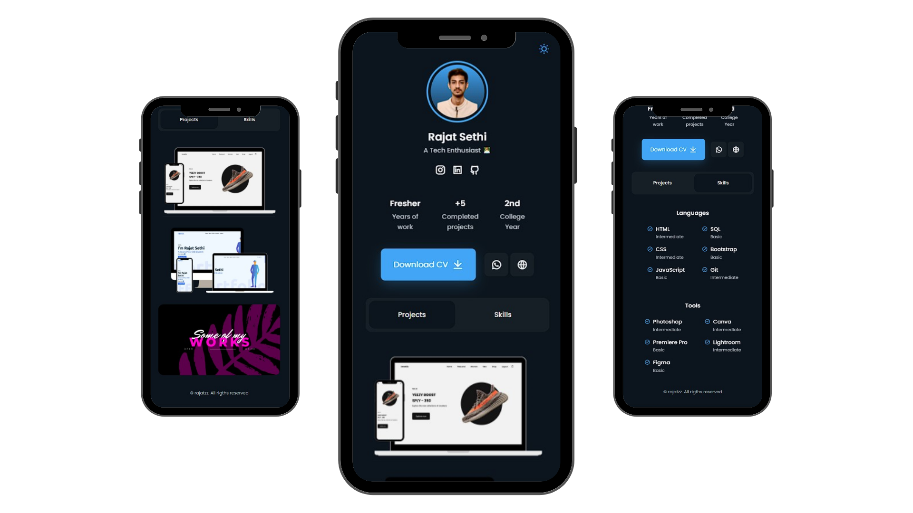

<h1 align="center"> Mini Portfolio Website </h1>

 

  

 

  
 &nbsp;
 &nbsp;

# Introduction 🚶🏻‍♂️

🎯 Welcome to the project repository of my website! 

This is My mini portfolio website, showcasing me. 

Works are still being done actively in the background to make it better. Should you notice some minor discrepancies like minor bugs and issues, please feel free to create an Issue.

## 📁 Files Included 

* index.html
* css files 
* javascript files
* sass files
* images folder
* pdf folder

## 🚀 Features 
1. Responsive mini portfolio website Using HTML CSS & JavaScript
2. Contains animations css.
3. Includes a dark and light mode. 
4. Developed first with the Mobile First methodology, then for desktop.
5. Compatible with all mobile devices and with a beautiful and pleasant user interface.

## 📍 Resources Used
* Icons: https://remixicon.com/
* Fonts: https://fonts.google.com/
* ScrollReveal: https://scrollrevealjs.org/
* Dopely colors: https://colors.dopely.top/color-pedia
* Youtube: <https://www.youtube.com/Bedimcode>

 
<h1 align="center">
  Give a ⭐ if you like this website! 
  

 
<h4 align="center">Reach me on </h4>
  

